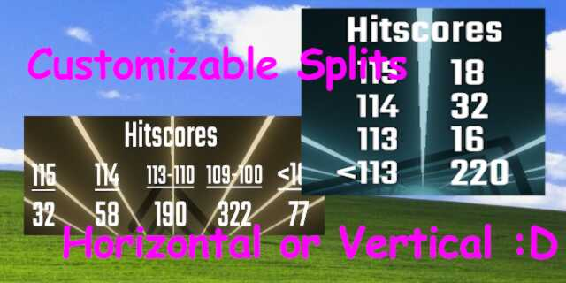

# HitscoreCounter

Counts the amoungts of cuts of a specific value. You can configure it to be vertical or Horizontal and can modify the ranges its split up into.

By default the splits are `115,114,110,100,0` which thus counts 115s, 114s, 113-110, 109-100 and everything below 100 seperately

Commissioned by [zachakaquack](https://www.twitch.tv/zachakaquack)

---

The Game version(s) specific releases are compatible with are mentioned in the Release title (Its obviously possible latest is not supported assuming its been released recently). If you need the plugin for an older version - Grab an older release that fits 🤯

## Install

#### You can always find the latest download in [The Releases](https://github.com/kinsi55/BeatSaber_HitscoreCounter/releases), simply drag the files into the respective folders

### Requirements

- [Counters+](https://github.com/Caeden117/CountersPlus) (Available in ModAssistant)

